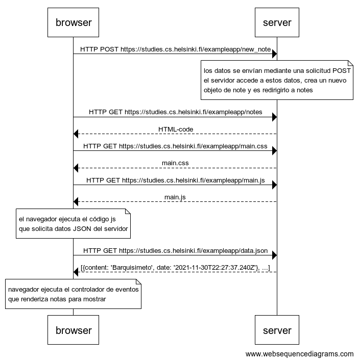

0.4: nueva nota

```
    browser->server: HTTP POST https://studies.cs.helsinki.fi/exampleapp/new_note

    note over server: 
    los datos se envían mediante una solicitud POST
    el servidor accede a estos datos, crea un nuevo
    objeto de note y es redirigirlo a notes
    end note

    browser->server: HTTP GET https://studies.cs.helsinki.fi/exampleapp/notes
    server-->browser: HTML-code
    browser->server: HTTP GET https://studies.cs.helsinki.fi/exampleapp/main.css
    server-->browser: main.css
    browser->server: HTTP GET https://studies.cs.helsinki.fi/exampleapp/main.js
    server-->browser: main.js

    note over browser:
    el navegador ejecuta el código js
    que solicita datos JSON del servidor
    end note

    browser->server: HTTP GET https://studies.cs.helsinki.fi/exampleapp/data.json
    server-->browser: [{content: 'Barquisimeto', date: '2021-11-30T22:27:37.240Z'}, ...]

    note over browser:
    navegador ejecuta el controlador de eventos
    que renderiza notas para mostrar
    end note
```

