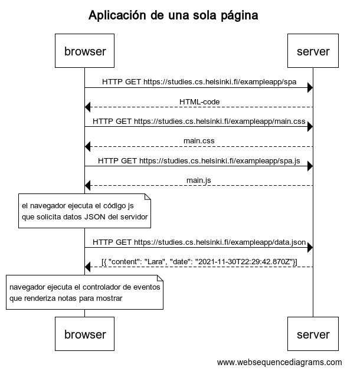

0.5: Aplicación de una sola página

```
    title Aplicación de una sola página

    browser->server: HTTP GET https://studies.cs.helsinki.fi/exampleapp/spa
    server-->browser: HTML-code
    browser->server: HTTP GET https://studies.cs.helsinki.fi/exampleapp/main.css
    server-->browser: main.css
    browser->server: HTTP GET https://studies.cs.helsinki.fi/exampleapp/spa.js
    server-->browser: main.js

    note over browser:
    el navegador ejecuta el código js
    que solicita datos JSON del servidor
    end note

    browser->server: HTTP GET https://studies.cs.helsinki.fi/exampleapp/data.json
    server-->browser: [{ "content": "Lara", "date": "2021-11-30T22:29:42.870Z"}]

    note over browser:
    navegador ejecuta el controlador de eventos
    que renderiza notas para mostrar
    end note
```
