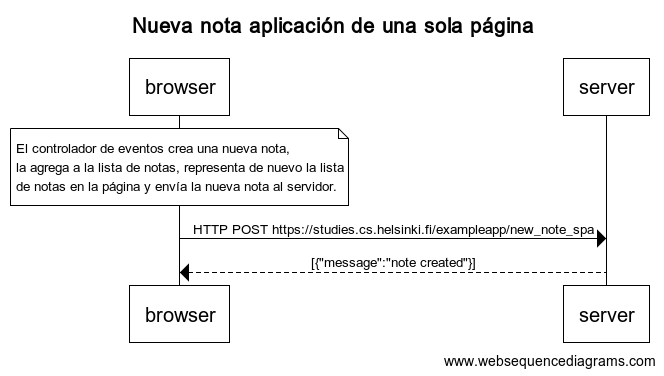

0.6: Nueva nota aplicación de una sola página

```
    title Nueva nota aplicación de una sola página

    note over browser:
    El controlador de eventos crea una nueva nota, 
    la agrega a la lista de notas, representa de nuevo la lista
    de notas en la página y envía la nueva nota al servidor.
    end note

    browser->server: HTTP POST https://studies.cs.helsinki.fi/exampleapp/new_note_spa
    server-->browser: [{"message":"note created"}]

```
